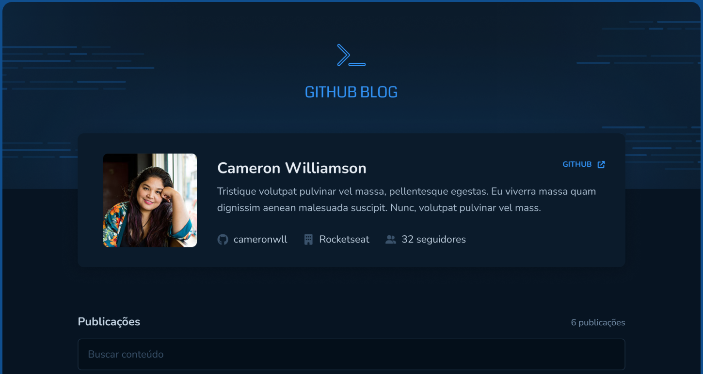

# GitHub Blog



<br>

## 🧪 Tecnologias

Esse projeto foi desenvolvido com intuito de listar issues de um repositório do github. Essas foram as tecnologias usadas no projeto:

- [React](https://reactjs.org)
- [TypeScript](https://www.typescriptlang.org/)
- [Styled-components](https://styled-components.com/)
- [Axios](https://axios-http.com/)
- [React-router-dom] (https://reactrouter.com/)

## 🚀 Como executar

Clone o projeto e acesse a pasta do mesmo.

```bash
$ git clone https://github.com/Wendhel06/DT-Money
$ cd DT-Money
```

Para iniciá-lo, siga os passos abaixo:
```bash
# Instalar as dependências
$ npm install

# Iniciar o projeto
$ npm run dev